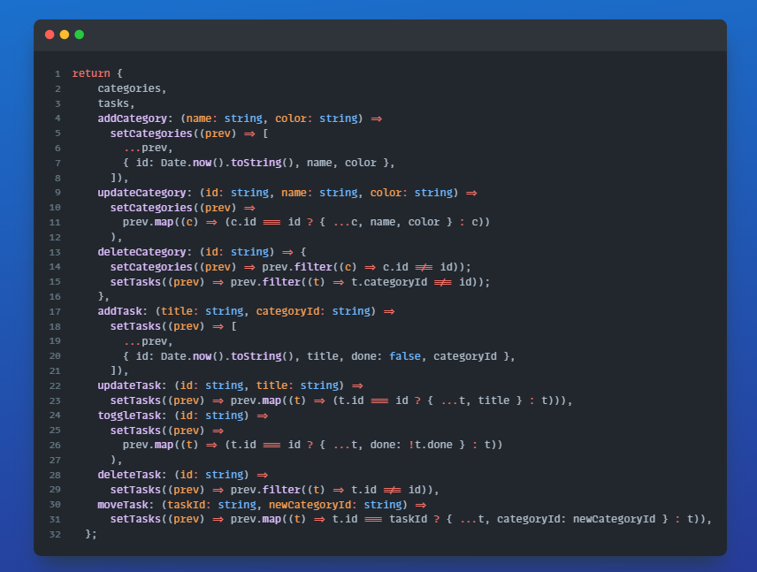

# Todo App

## Tech Stack

- Next.js 16
- TypeScript
- Tailwind CSS
- Framer Motion

## Getting Started

```bash
After opening VRCAFE-CHALLENGE in your IDE =
CD opdracht
npm i
npm run dev
```

Open [http://vrcafe-challenge.vercel.app
](http://vrcafe-challenge.vercel.app) in your browser.

## Features

### UI/UX Features

- **Smooth Animations** - Fun and interesting animations built with Framer Motion
- **Responsive Layout** - Mobile-first(sorta) design with collapsible bar
- **Touch-Friendly** - Large buttons, proper spacing for mobile interaction
- **Visual Feedback** - Hover effects, scale animations, drag indicators
- **Color-Coded Categories** - 4 predefined colors with visual dots, very state-of-the-art
- **Dark/Light Mode** - Sun/moon toggle with smooth transitions

### Code Features

- **Custom Hooks** - Clean separation of logic with useTodos hook
- **Local Storage** - Data storage and functioning in sessions
- **Drag & Drop** - Drag + touch events for mobile
- **Component Architecture** - clean code and reusable friendly


